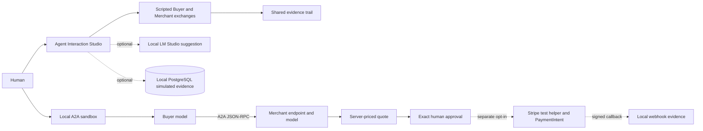

# What each mode demonstrates

The Studio runs in the browser from scripted, versioned fixtures. Its buyer approval, token, provider event, and recovery paths are fictional. The optional durable Studio mode writes simulated operations and receipts to local PostgreSQL; it still makes no Stripe call.

The local A2A sandbox is a separate workflow. The Buyer and Merchant use LM Studio through a local OpenAI-compatible endpoint. The Buyer sends a task through the open A2A JSON-RPC transport to a local Merchant server. The Merchant determines the price from the demo catalog and validates the model's review. Only a human approval can enable the separate payment step.

For Stripe test payment, the seller-side SPT test helper simulates a granted token. The app validates the account, exact amount, token scope, and retrieved PaymentIntent; it reserves one attempt with an idempotency key. An uncertain provider result is reconciled read-only. Signed webhooks can add evidence when a matching CLI listener is configured. No production payment or fulfillment path is included.
